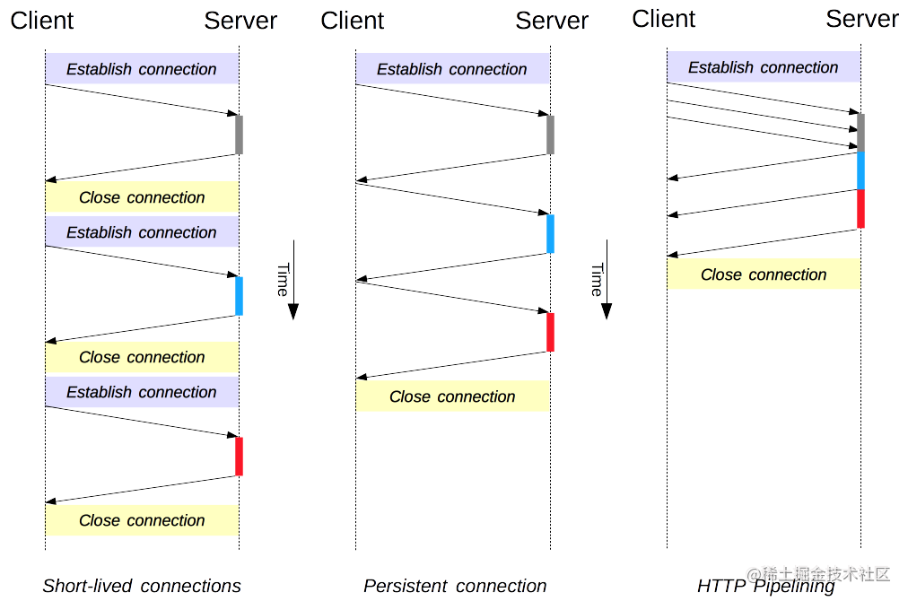

# 浅浅的聊一下 WebSocket

> 第一次看到 `ws://` 和 `wss://` 时候，感觉好高级啊，还有这种协议。

## Websocket 历史

WebSocket是在2008年6月诞生的1。经由IEFT标准化后，2009年chrome 4第一个提供了该标准支持，并默认启用。于2011年由IEFT标准化为[RFC 6455](https://datatracker.ietf.org/doc/html/rfc6455)。

现在的浏览器均已支持该标准。

## Websocket 出现的背景

思考一下我们经常遇到的一种需求场景，要求在某个网页下，网页的内容可以实时更新。

这种情况下，最大众化的方式就是轮询接口了，即通过定时器，定时请求接口，获取到最新的信息后，将内容更新到页面中，如下：

```ts
setInterval(() => {
  queryAPI().then(() => update());
}, 1000);
```

但是我们知道，这种定时器的延时并不是很精确，而且加上接口的请求时延，实际时间可能不止代码中所预先设定的时间长度，所以这种实时更新是伪实时更新。

除此之外，还有一点可能会经常遇到，即，我们更新信息并总是要更新整个页面上所有可以看到的信息，我们更关注一些经常变化的信息，比如状态，状态的信息可能大小只有几个字节，但是我们轮询接口拿到的信息却是这个页面的所有信息，大小自然不只几个字节，但是除状态以外的信息都可以视作是冗余的。


我们实际只需要一个字段，而且即使后端提供只返回状态的接口，但实际在一个请求中还要计算ip报文头的大小，依旧是很占用带宽的。

轮询这种解决方案目前依旧是非常流行，最新的轮询技术是Comet，这种技术虽然可以实现双向通信，但仍然需要反复发出请求。而且在Comet中普遍采用的[HTTP长连接](https://zh.wikipedia.org/wiki/HTTP%E6%8C%81%E4%B9%85%E9%93%BE%E6%8E%A5)也会消耗服务器资源2。

## Websocket通信模式

了解网络的都知道，数据传输分为单工、半双工、全双工三种工作模式。

Websocket是基于TCP的，使用全双工通信模式的协议，他使得客户端和服务端之间的数据交换变得更简单。而且，作为一个工作在全双工模式下的协议，服务端可以在建立连接后随时向客户端推送消息。

由于协议是基于TCP的，所以websocket也是需要建连和关闭连接的，但要注意的是，一般在websocket的握手通常指的是：客户端发送一个http请求到服务端，服务端响应后标志这个链接建立起来。而不是指tcp的三次握手。

另外在[RFC 6455](https://datatracker.ietf.org/doc/html/rfc6455) 1.1节「Background」中介绍：WebSocket通过HTTP端口的80和443进行工作，并支持HTTP代理和中介。

> 原文：***it is designed to work over HTTP ports 80 and 443 as well as to support HTTP proxies and intermediaries***

为了实现和HTTP的兼容性，WebSocket握手使用HTTP的Upgrade头将HTTP协议转换成Websocket协议。

作为一种协议，websocket自然也是有其用于**协议控制**的头部信息的，但是相对于HTTP请求每次都要带上完整的头部信息，传输数据时，websocket数据包的头部信息就相对较小，从而降低了控制开销。

相对于前文所提到的轮询接口，websocket可以做到服务端直接向客户端传输数据，省去了客户端发起请求的步骤，同时没有间隔时间，只要服务端内容变化，就可以告知客户端，实时性上有了很大的提高。

## Websocket 使用

WebSocket使用十分简单，只需要关注以下API：

1.  `WebSocket(url[, protocol])` 构造函数

使用 `new WebSocket(xxx)` 创建对象时，会同时建立与服务器的连接


2.  `WebSocket.onopen` , `WebSocket.onclose`

分别对应连接成功、失败时的回调，这里可以做一些初始化、销毁的工作

3.  `WebSocket.onmessage`

实际处理数据是用的该函数

> 在数据处理完成后，需要移除回调函数，不然可能会影响到其他地方的处理

```ts
const ws = new WebSocket('ws://sdf.com');
function handleData(evt) {
  // handle server data.
}
ws.onmessage = handleData;
ws.addEventListener('message', handleData);
```

4.  `WebSocket.send`

主动向服务端发送消息，可以通过send和onmessage进行数据互动，如：

```ts
ws.send('list');
​
ws.onmessage = evt => {
  const data = evt.data;
  if (data === 'hello') {
    console.log('world');
    return ;
  }
  try {
    const obj = JSON.parse(data);
    switch (obj.type) {
      case 'list':
        // do something.
    }
  } catch (ex) {}
}
```

5.  `WebSocket.close`

关闭连接

> Node服务端的实现，这个就参考相关的库吧，比较复杂。

## 衍生知识

http协议至今，主要经历了三个版本。

-   http1.0 短连接，单工通信

    -   http/1.0默认的模型是短连接，每个HTTP请求都由他自己独立完成，下图左1，可以看到每一个http请求都对应了一个建立连接关闭连接的阶段，每一个请求都有TCP握手和挥手的阶段。
    -   在这个模型下，想要做到实时更新页面数据，只能考虑轮询。

<!---->

-   http1.1 支持长链接，半双工通信

    -   1.0之后的版本，1.1会让某个连接保持一定的时间，在这段时间里重复发送一系列请求（下图左2），就是保活。

<!---->

-   http2.0 支持多路复用，全双工通信



## 参考文献

[1]  [[whatwg] TCPConnection feedback](https://lists.w3.org/Archives/Public/public-whatwg-archive/2008Jun/0165.html)

[2]  [wiki](https://zh.wikipedia.org/wiki/WebSocket)

[3]  [RFC 6455](https://datatracker.ietf.org/doc/html/rfc6455)

[4]  [Websocket教程](https://www.ruanyifeng.com/blog/2017/05/websocket.html)

[5]  [HTTP1.x连接管理](https://developer.mozilla.org/zh-CN/docs/Web/HTTP/Connection_management_in_HTTP_1.x)